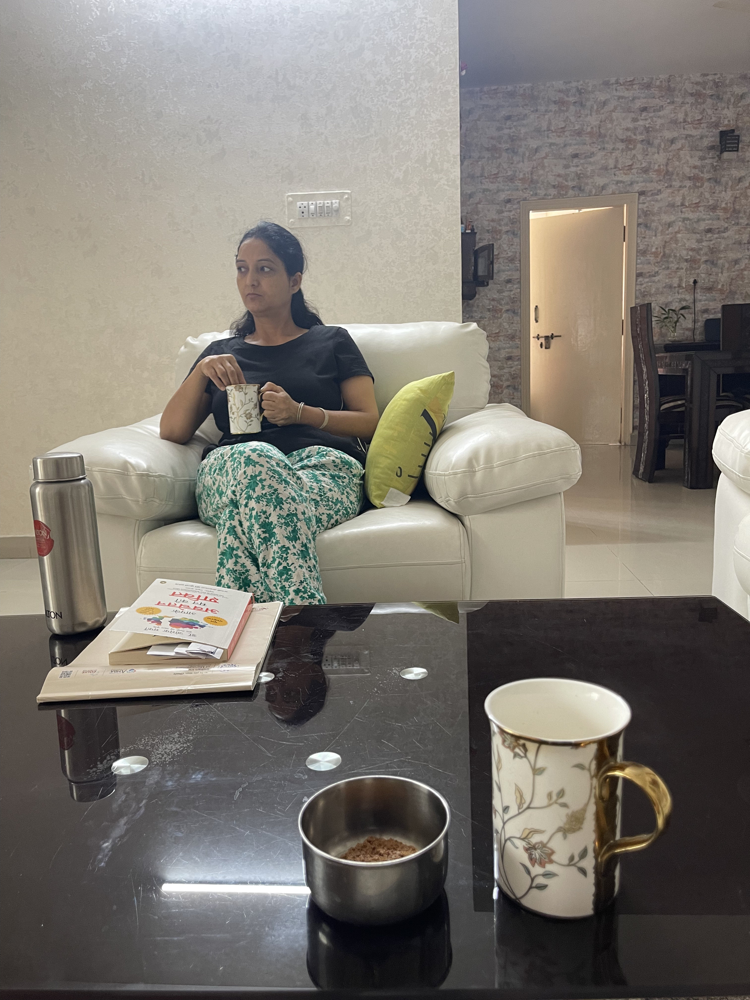

# 2nd April 2026
## I am going to miss mom...

For whom the bells toll ? For it tolls for thee...

In an entirely different context though lol.  
As in I can feel my stay coming to a halt over here, and I hear whispers of <i>that</i> city drawing closer.

Ah, that city... well, let's not distract ourselves.

It's been an unusual couple of days for me lately, as I have been able to wake up early in the morning despite my  
continuous failure, ever since my arrival here. Feels great to break this spell, but oh I wish it had worn off sooner!  

This morning I wrapped up a lecture from the lld series, and solved all the tagged questions as well.  
Documenting them in the IDE is an effort though, so much for structure but an equally hard hit on productivity.  

Everything in life has it's trade-offs I suppose. Moving on...

Post the first stretch, things went a little slower, and emotions went heavier. They seem like a ticking time bomb  
in these time to be honest.

However with his grace, I guess I was resilient and made it through the patch with much difficulty. Please god, go  
easy on your boy no ? Lately I find myself out of words to say to him, and just wave my hands at him a lot. 
Just want him to notice me I guess...

Got news that my <i>ghar waale</i> are coming to stay at our home for a while. This will bring a change of pace  
and turn things up by a notch I suppose.

Anyways, I ended up completing all the pending questions for the `array techniques` lecture and found myself  
heaving a sigh of relief. A lot of work items are still pending though. Need to power through some tedious stuff as well.

Alright, it's late and I haven't yet logged my `daily_progress` for the day yet.  
So see ya and good night!