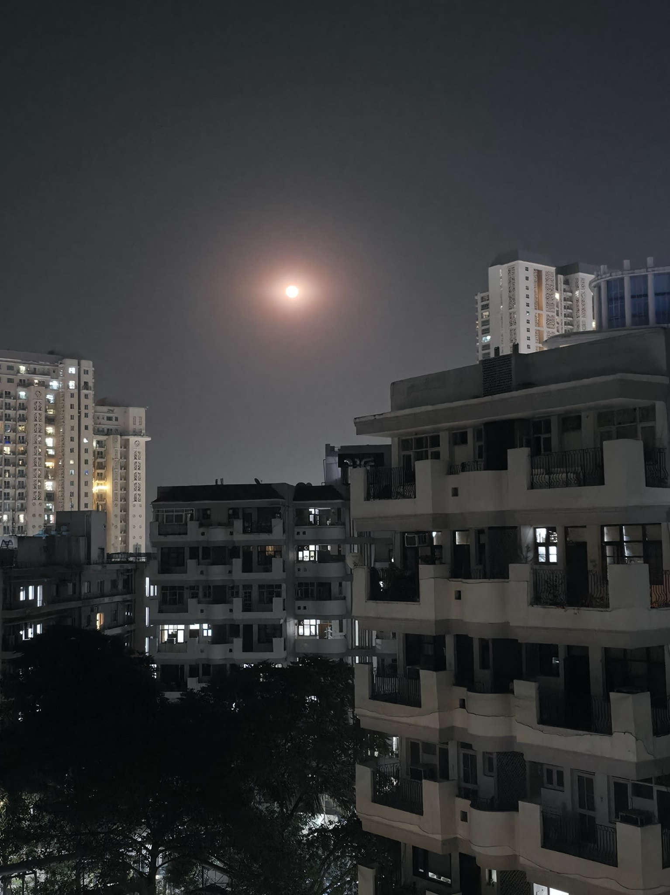

# 3rd April 2026

[//]: # (## <i>La Lune est très paisible</i>)
## <i>La lune est magnifique c'est soire</i>

Look at it shining, confusing the vast dark skies around it. It's almost as if the sun himself showed up.  
Gazing at it brings about a certain stillness inside me. It's one of nature's rare sightings, glad to have witnessed it.

This scenery is of yesterday evening, occurring at the special occasion of Lord Hanuman's birthday.  
A perfect full moon.

My cousins, accompanied by the elders have arrived at our place today, and the atmosphere around here  
has turned pretty jolly. Still, a certain quietness of loss, and heartbreak lingers. Or maybe it's just me haha

On the productivity front, it's a shy day. I only handwrote the notes for the lld lecture, and those too need finishing.

I wrote the journal pretty early today, it's only 4 PM right now as I might not have the heart to pour myself out  
in the midst of everyone. It's okay right now as most of the gathering is asleep or resting.

Later this evening, we will be joined by Lucky Bhaiya, coming all the way from Thailand.  
He has been vacationing there along with his childhood friends. He had not originally planned to come visit us,  
but he wants to see off my maternal uncle, whose leaving for Singapore tommorow evening.

I too will disperse from here in some days. It's been a good stay here. But I, too must leave, I too must continue...

Alright then.. catch you later