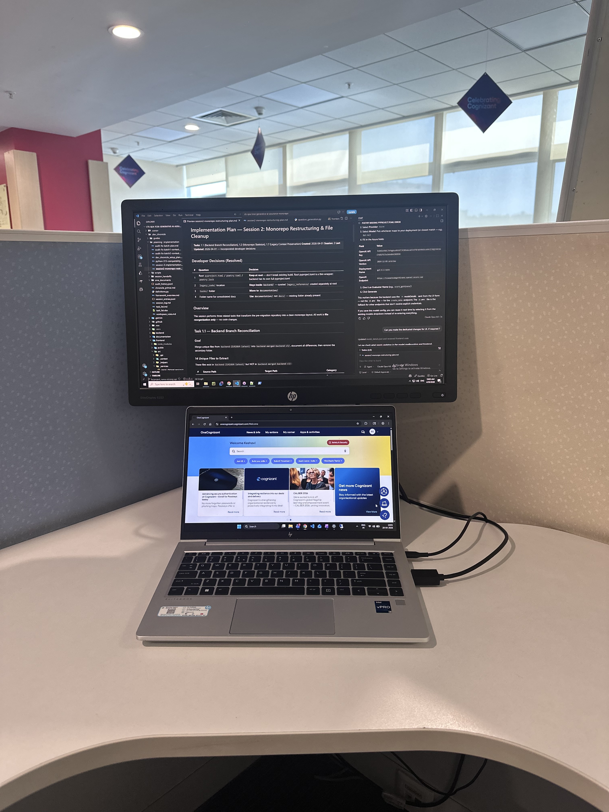

# 21st April 2026

## मन अटकेया, बेपरवाह दे नाल...

Sometimes, I feel like life is a song.  
With it's various genres, moods and tones, creating an atmosphere and wrapping an individual's experience in a bubble.  

As I inspect what I wrote, it seems odd that even I do not fully comprehend the full gesture, nonetheless is oddly making  
sense.

I am aware that my frequency and commitment is not what I had originally promised to myself, but I am determined to put 
in extra efforts, find the blind spots, fill in the cracks and keep the flame alive.

Each passing second is an effort on the eyes, as I am awake since 4 AM and sincerley plan to repeat the same towards the  
following morning.

Let me rest eyes, withdraw myself, and take my leave now.  
Good Night.