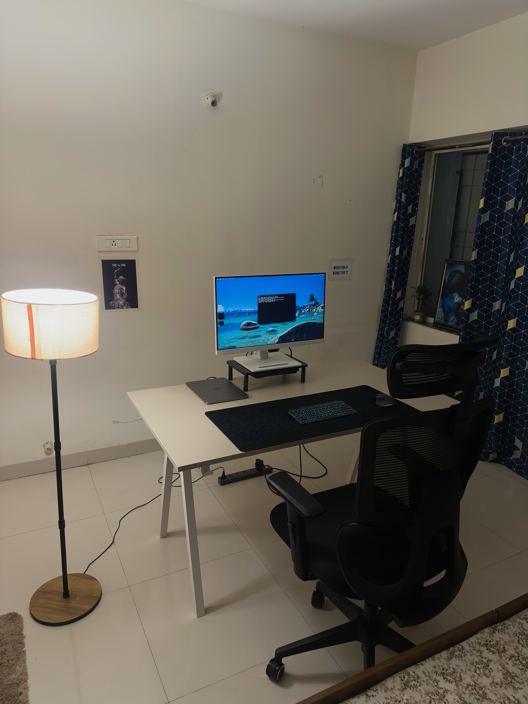

# 22nd April 2026

## गंगा के किनारे बैठ के...

जाने दे जो चला गया... कुछ भी नहीं तेरे हाथ में बंदेया ll

Finally my chair has arrived today, YAY 
As time passes, you can witness my setup evolving. One would think it is now perfect and doesn't require any further 
enhancement, and that is exactly where you would be wrong, hehe. These couple of things do be missing though... 
- A footrest
- A botle / cup holder

I get it, the cup holder seems unnecessary, and maybe I actually won't to go ahead with it. But the absence of a 
dedicated footrest is felt dearly, oh god. Even as I write this journal. I feel tingly and weird in my toes and legs.

It literally has a lot to do with posture and blood circulation in the body. So much so that even when I am back home,  
the thought used to linger at the back of my head as I used to work.

### The Day In a Nutshell ?
As the seventh floor of the organization building has been entirely allocated to a client, I have been making a quite little 
nest at the third floor. A colleague has been keeping me company and we seem to adjust quite well to the atmosphere there. 

Today, I woke up late, but was still able to get my hands dirty and solve some questions.  
It felt like I picked up some pace and continued to do so during the organization hours at well.

Not the best behavior, completely agreed, but the tasks assigned are heavily reliant on AI and frankly, no real learning  
nor growth is taking place. However, I want to turn tables around, and contribute more, just because that's not the kind 
of person I am, despite what I am becoming. Yeah.

I feel so desperate to do Rust and Operating Systems as well. 
Oh my, only if I managed my time better...  

Still, with his grace these last couple of days have seen at least some activity, and I want to carry the momentum forward.

Alright then, see ya soon enough, 
heyitskdk

