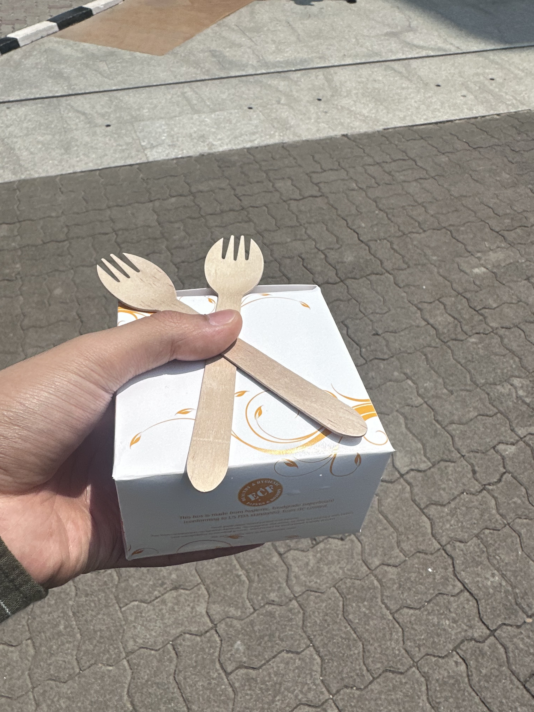

# 23rd April 2026

## _i'm never rockin' white i'm like a racist_ _that money is the only thing i'm chasin'_

And some dope dimes on some coke lines... **nah**  
Just been listening to this melody a lot lately, and my brain has decided to get stuck on this lyric, replaying it time 
and time gain. I wonder whether that's what the brain does. Pro-actively looking for new loops to indulge in.

Sorry for the picture though. Had no clicks today, and the one on the wall is from yesterday.

Had a heavy talk with ma. One thing led to another, and things started going down memmory lane. 
The absolute worst place to be in. After a while, the head starts to hurt as memories start to spin.  
Spite starts fueling up for god, the times, me, the universe, everything. It's a dark place to be in. 
I pray nobody has to touch upon that dimension _ever_ in their life.

Life feels unjust, unfair, and nobody knows why. That's the dark part.

Sometimes I wonder, if I could get another life to start over fresh without the baggage I hold.  
Till then, it's a drag I guess.

See ya, and good night.  
heyitskdk