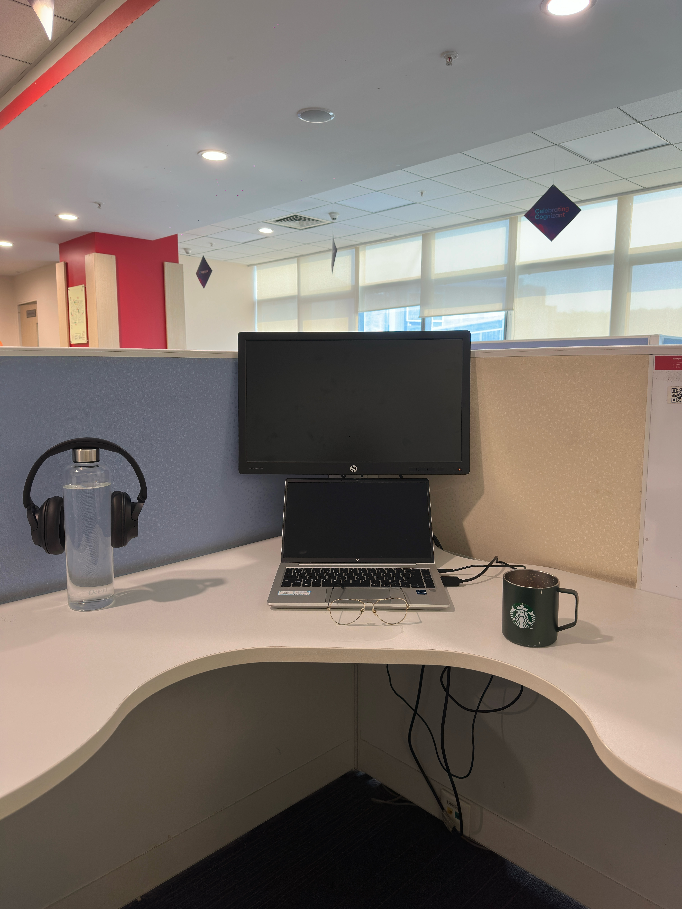

# 24th April 2026

## मन अटकेया बेपरवाह दे नाल

Wow, had an interesting converstaion with Claude today. 
Was feeling unusually heavy, and often GPT is my go to, but I was like what the hell. Let's see what Claude can ccok.

Tried changing my location to another wing. Mostly because I wore a nice outfit, and wanted to grab some looks from the  
ladies, just to feel nice about myself. Doesn't work that way. Friday has a lot less people showing up to office anyway.

Major update though.  
The chair I purchased recently turned out to be a bad fit for my shape. I discussed returning it, while exploring the  
prospects of transporting my existing chair from back home to all the way over here, with dad.  

Turns out he wants me to return the new chair as well, but advised against the transportation of the chair back home.  
Rightly so, because the last time it was attempted, it suffered a bad hit, and it's main support broke. I was lucky that the  
chair was under warrany, and the company after a discussion, agreed to replace the part. Phew.

So, he has offered to chip in some extra bucks from his end, and wants me to go for the same chair back home. Wow, this  
took me aback, really. I was not in the least expecting it.

I really put in a lot of effort when I was researching for the right chair, and only god knows how many stores I had visited  
physically, and the pain I put Chat GPT and Claude through.

Even after that, I on my end made a bad decision and purchased the wrong chair. But the universe had seemingly other plans  
for me, and guess it decided to reward my efforts ? It really all is a mystery.

All I can say is, I am grateful. Thanks.

When it rains, it pours.  
Metaphorically, yes, plus it actualy did rain today. A good burst of shower. Turned out to be a nice little evening.

On the productivity front, yeah. It's a low score today,  
But I am going to keep showing up. Gradually, productivity will flow.

Alright then, that was it for today. Stay tuned for more updates,  
heyitskdk