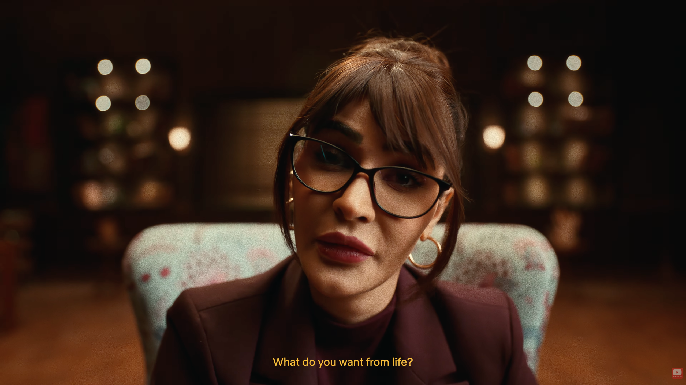
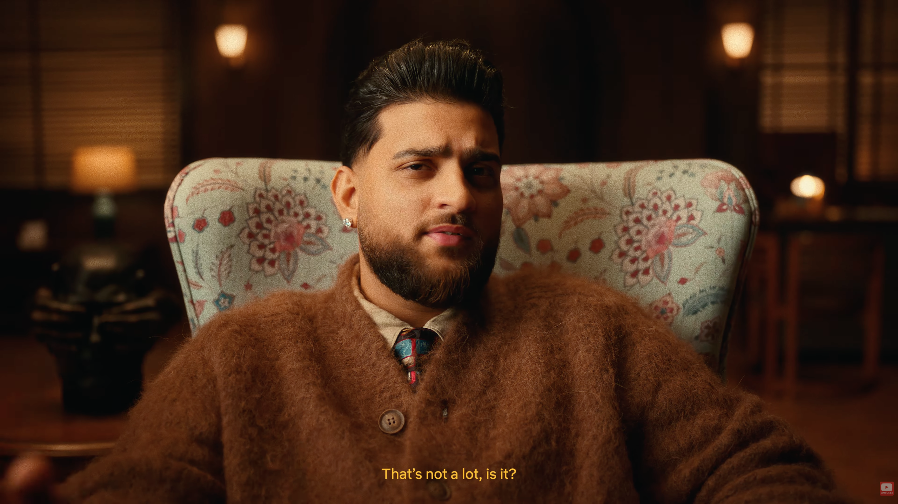

# 26th April 2026

## _five, seven things and I'll be happy_

> पांज सात चीज़ां हुण पहली बेबे खुश होवे,  
> दूजी मेरी बापू दी हाए रब वाल मूंछ होवे,  
> तीजी होवे ओट ओहदी ऐना मुण्डा लक्की होवे,  
> जान मेरी जावे मेरे यारां नूं ना कुछ होवे ll

A girl too perhaps, mom says to ditch even the thought of it.  
She's not wrong, since it became the root cause of all misery _dans ma vie_.

And it still hurts. Happiness, doesn't leave a lasting impact as much as pain does. 
Was it a design choice, lord ? The engineer in me asks.

> I know I'm not the centre of the universe,  
> But you still keep spinnin' round me just the same

Constantly been dreaming of her each night. I gave her tough nights and good mornings (always).  
Why do I get heavy mornings ? Do you pick favourites ? Or is everything random, and you're unbothered with  
your own creation and just rules have taken over the entire system.

That's why I asked for the luck, to be your favourite, have your support through all, `तीजी होवे ओट ओहदी ऐना मुण्डा लक्की होवे`

Where is your grace, when someone most needs it ? I see so much, so much suffering in the world.  
Don't blame my lens sir, please. I see it everywhere around me. Why do I feel empathetic about your world, while you 
seem unbothered ?

I know everyone finds their own problems to be the heaviest, but what other frame of reference does one even have ?  
One _can not feel_ anybody else's emotions, they can only experience _their own_ events.

I didn't know I hold so much doubt and resentment in my heart for you, while on the surface being completely surrendered.  
Let me be honest with you, god. It's all an act, to get your attention, and hopefully turn things in my favour.

> I keep draggin' around what's bringing me down,  
> If I just let go I'll be set free

If I let go, I fear, I will lose all identity.  
At least this pain reminds me, that something is yours. It is _your pain_.

So, what does kdk want from his life ?  
Sometimes everything, mostly nothing, just love. Whatever feels true to the moment.

That's my time for today. Thanks,  
heyitskdk