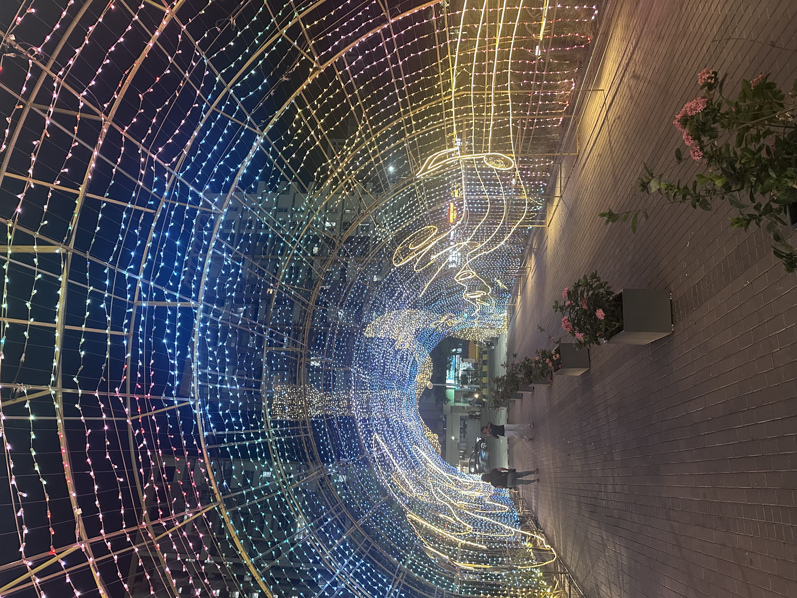

# 27th April 2026

## _fist my bump?_

No two days are the same. Today in particular was light and some what ecstatic.  

I was even able to get some good quality work done. This brings me to beleive that when a task appeases or interests me,  
I am willing to spend some time on it. Otherwise, perhaps I was just hyped up on some very good tea, lifting my spirits and  
bumping up productivity.

_Hey God_, can I have more days like these?

But to be entirely truthful, my personal tasks catering to the `the-dream` have still been very much on hold. However, I am 
positive and certain, that I shall resume them very soon. The journey is rarely _(I daresay never)_ linear.

Upon returning home from work, I experienced an urgency to go and grab seats for the film `Project Hail Mary` while it  
still continues to run in the theatres. I remebered my colleague praising it to great lengths, and have experienced some great 
work by the lead actor personally, in `La La Land` and well, `The Notebook`. I genuinely enjoyed my time in the theatre, 
and do not regret sacrificing some late hours in the night for it.

Unexpected outings like these can be a surprise on the wallet though. Found myself spending slightly above `₹1000` for the 
entire experience. Eh, not a very wild run. But still, could have been more mindful.

Reached home to find my flatmate very much awake, excited and looking forward to participate in badminton games this coming 
long weekend. We discussed upon some prospectful venues, timings and related things, post which, I went for my dinner.

That finally brought curtains to the night, and a day to reminisce.  

Thanks, that's all I have for today. 
heyitskdk
