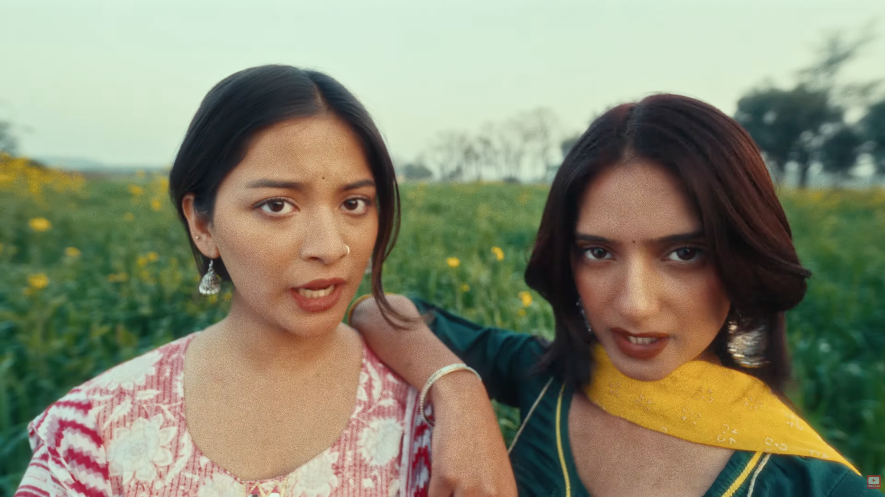

# 28th April 2026

## _you're only looking for attention_

Guilty as charged.  
Went to work dressed sharply today. Was hoping to turn some eyeballs and garner a few looks from the ladies.  
Sigh... If only  it worked that way bro. All I got was a bunch of dudes eyeballin' my outfit, nothin' more.

I sense that this might be desperate behaviour, and might need dialling back down. Who doesn't like female attention!  
Oh, but at what cost? There are no lengths to which a man can go to get noticed, and I sense that length is directly proportional  
to the depth of one's pocket. And I am leaking heavily as it is.

Shit, it'd still be nice to have a female presence in my life. Even after the tremendous amount of turmoil and internal sacrilege  
your boy went through. Now that's what I call courage.

I discussed the same with Ma, and she sugested to straightaway just get married instead. _Oh boy_, what a take.  
I instantly dismissed the idea, and expressed my desire to naturally fall in love with a woman, and love her through the ends.

_Hey God_, I am still capable of love, despite what it might seem okay?  
It's not the urges I swear. It's just the presence. You get what I mean. Life is rough as it is, a certain tenderness to the mix  
lightens up the experience. Being a male in India, I know I have tough odds, but it just feels nice to at least think that I have a shot.

Fought the urge and resisted the temptation to violate a burger this evening. Without putting in too much thought, I gobbled  
two bananas, to at least alleviate the craving. Further distracted myself with work, and finally in the end ate dinner.

This does bring my day to a close, even though the heart's left wanting more.

`जट्ट कल्ला रेहंदा जीवे बादशा कुड़े`  
`नी असी गोलिया दे तोलिया च घाट मिलदे`

heyitskdk
