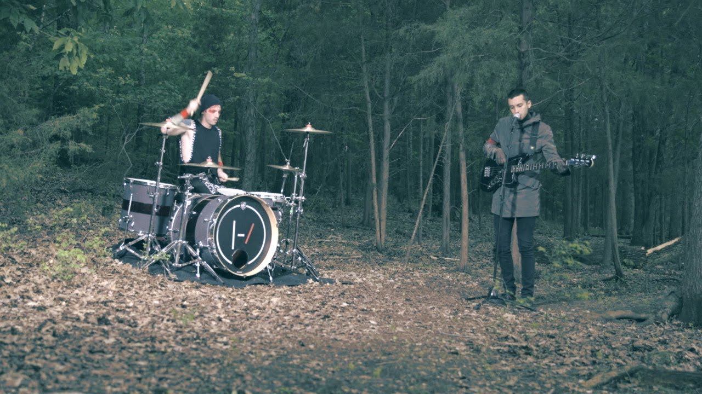

# 29th April 2026

## _they saw newcomers have a certain smell   yeah, trust issues, not to mention   they sayin' they can smell your intentions_

> You'll have some weird people sitting next to you  
> You'll think, "How did I get here, sitting next to you"

Isn't this just how the world around you operates after certain point in life?  
_How did I get here_, I think, is the most common feeling of them all I believe.

Even _Tupac_, seems to share this moment of disbelief on the record `Only God Can Judge Me Now`
> _How did it come to this_  
> I wish they didn't miss

What can we say 'Pac, life is full of surprises. We feel you though.  
May his soul rest in peace, truly.

Had a quite busy day today. Experimenting with terminal, enjoying _living there_ more and more.  
Want to fully explore Linux and it's kernel, if and when the time permits, as I persist.

That last bit rhymed, eh? Naturally, of course. Been listening to much music lately.

Wanted to take the day off tomorrow. Can't as our project lead is finally returning after a long period.  
I can not afford to raise eyebrows over my absence, especially on such a day.

Alright then, the night is drawing closer, and have a lot of stuff lined up for tomorrow.

See you, and good night,  
heyitskdk