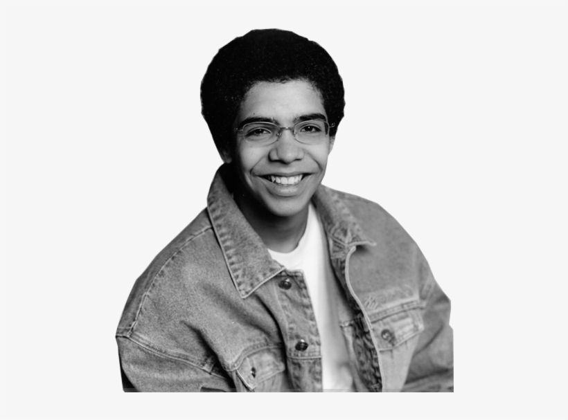

# 28th May 2026

## _somewhere b/w psychotic and iconic._

Hi there,  
It's been a while. Do not have much to say except that life has picked up a different turn now.  
Things have gotten pretty shaky at the corporate front, and my future is in god's hands.

My organisation is undergoing a _restructuring_, and I have found myself to be caught up in the midst.  
I am currently serving time on the bench, and waiting my time out. Hope, everything works out as god intends it to be.

In the meanwhile, I have been brushing up my old project, the `knowledge-management-bot`. I am trying to re-create it  
from scratch with better principles and engieering applied. Enjoying the process, hope I can continue with it.  

After a heartbreaking gap, I have again mustered the courage to continue with algorithms and problem-solving.  
The path is not very clear, hope I can work that out as well with time.

Truth be told, I do want to continue to be a part of this organisation anymore, but I fear the outside.  
This has been home to me for almost four years now, almost as long as my gradutaion years. Even longer I suppose, 
as I was home for around two years due to covid'19. And these fours years were my _real college_. Damn near consisted of everything.  
Work, learning, fun, heartbreak and so much more. I feel like I have become more of a man now.

Thank you god, if that was your intention. I leave everything in your hands going forward.

Yours psychotically/iconically,  
heyitskdk
