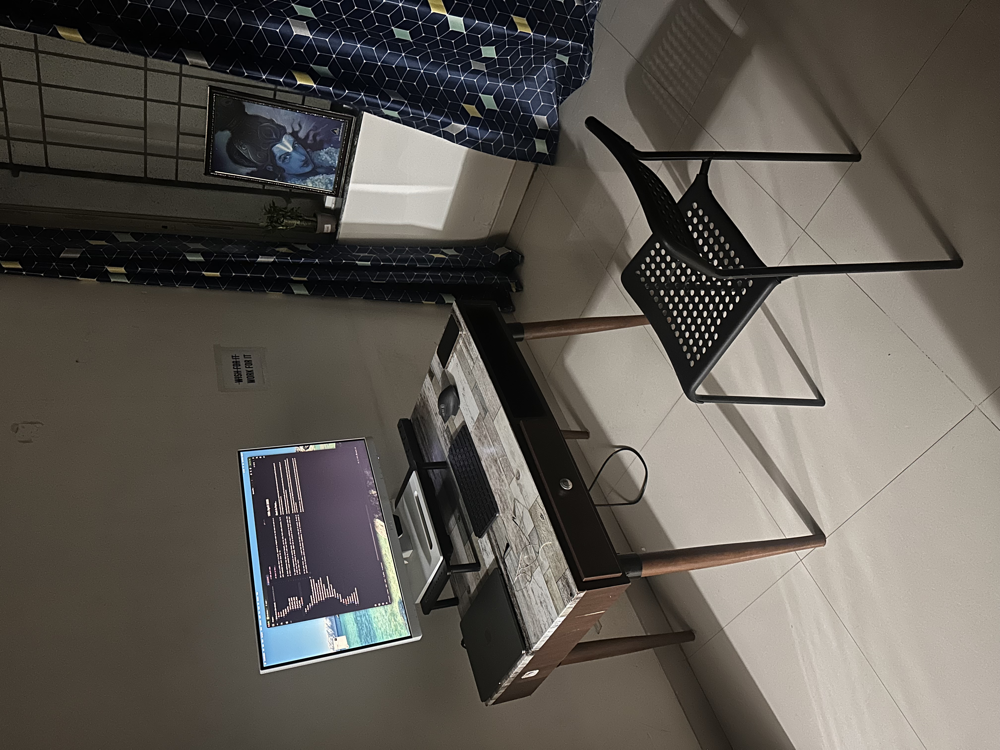

# 15th April 2026

## Back in Pune...

It's been a while since I am back, against my original wish to stay back and work on myself from Gurugram itself.  
Life seemingly has other plans for me.

It feels different this time around though, and the city feels oddly welcoming. Is it just due to a change of pace, or  
is there a deeper meaning to it, I will soon find out.

The city's temperatures are soaring though. It's been a challenge to manage daily life and it's activities without an AC.  
I still have been putting up though. Might take my business to office more often than I thought, at least the climate  
is much nicer there.

On the work front, yes... I agree that there has been a slowing down of events. Do not want to give any excuses for it, 
and promise to increase effort and consistency.

A lot of friction from the mind has now been uprooted, so things shall sail nicely from here on now. I am taking forward  
a postive attitude, and shall put all my work force together towards the prophecy put forth in `Dream.java`

Now that the pleasantries are done, I will now commence forth towards the original intended practices.  
Oh how my writing tone has transformed, just me and, god is aware.